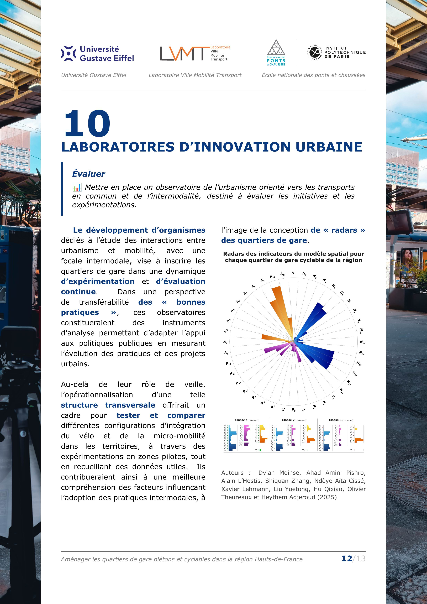
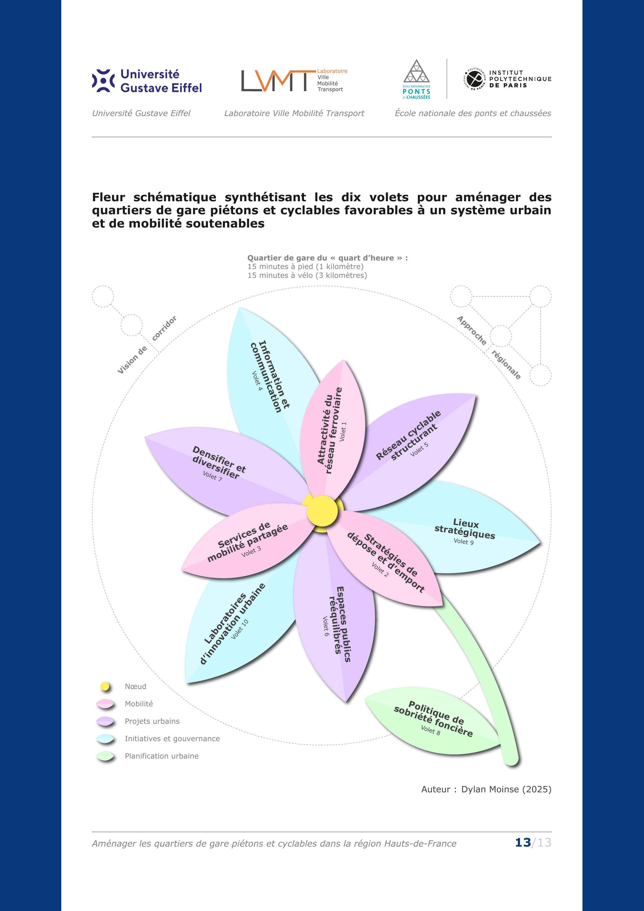

# *LaTeX* Policy Brief Template

This *GitHub* repository contains the *LaTeX* source files for a policy brief published on [*HAL*](https://hal.science/hal-04997615) and [*ResearchGate*](http://dx.doi.org/10.13140/RG.2.2.21093.31205)
(DOI:10.13140/RG.2.2.21093.31205).

This document summarises the research carried out in my doctoral thesis available through these GitHub repositories ([French](https://github.com/dylan-moinse/PhD_Thesis_Dylan_MOINSE_French) and [English](https://github.com/dylan-moinse/PhD_Thesis_Dylan_MOINSE_English)).

## Repository Structure :open_file_folder:
The repository is organized as follows:

* `main.tex` - The main *LaTeX* file that compiles the policy brief.
* `main.cls` - The main style file that contains packages.

### Style and Formatting Files :art:
* `backgrounds.sty` - Background strips on the left and right of each page.
* `colors.sty` - Institutional colors.
* `fonts.sty` - Font settings.
* `footers.sty` - Footer title and page number settings.
* `headers.sty` - Header logos.
* `macros.sty` - Commands.
* `margins.sty` - Margins.
* `sections.sty` - Sections settings.
* `volets.sty` - Boxes.

### Bibliography :open_book:
* `DM.bib` - The bibliography file containing all references.

### Content :black_nib:
* `text/...` - Contains all sections (`00-front-page.tex`, `01-tc.tex`, *etc*.).
* `figures` - Stores figures.
* `logos` - Stores logos for headers.
* `background` - Stores background images.

## Compilation Instructions :arrows_counterclockwise:
To compile the document, choose one of the following methods:

### Local compilation with `latexmk` and *LuaLaTeX* :computer:

If using a local *LaTeX* editor, run the following command:

```sh
latexmk -pvc -quiet main.tex
```

After five compilation iterations, the final PDF version of the policy brief will be generated.

### Using Compilation with *Overleaf* :signal_strength:

You can also use *Overleaf* to compile the thesis.

## Dependencies :wrench:
Ensure that the following *LaTeX* packages are installed and updated:

| Category| Packages |
|-----------------------|-------------------------------------------------------------|
| **Core Packages** | `ifthen`, `etoolbox`, `xparse` |
| **Page Formatting** | `titlesec`, `titling`, `setspace`, `typearea`, `eso-pic`, `afterpage` |
| **Headers & Footers** | `fancyhdr` |
| **Fonts** | `fontenc`, `fontspec` |
| **References** | `hyperref`, `appendix`, `refcount` |
| **Glossaries** | `glossaries` |
| **Graphics & Tables** | `graphicx`, `subcaption`, `tabularx`, `booktabs`, `multirow`, `longtable`, `caption` |
| **Mathematics** | `amsmath`, `amssymb`, `newpxmath` |
| **Color & Code** | `xcolor[dvipsnames]`, `tcolorbox`, `minted`, `fvextra` |
| **Text & Lists** | `enumitem`, `varwidth`, `contour`, `ulem`, `mfirstuc`, `csquotes` |
| **Date & Time** | `datetime2` |
| **Miscellaneous** | `blindtext`, `lipsum`, `silence`, `textpos`, `tikz`, `lastpage`, `ragged2e`, `needspace`, `emoji` |
| **Multi-column** | `multicol` |
| **To-Do Notes** | `todonotes` |
| **Subfiles** | `subfiles` |

If using *TeX Live* or *MiKTeX*, all required packages can be installed via package managers.

## Screenshots :scissors:

Screenshots showcasing the structure and style of this 15-page document:

<table style="width: 100%;">
  <tbody>
    <tr>
      <td align="center" valign="top" style="width: 33%;">
        
        <br />
        <sub><b>Cover Page</b></sub>
      </td>
      <td align="center" valign="top" style="width: 33%;">
        
        <br />
        <sub><b>Introduction</b></sub>
      </td>
      <td align="center" valign="top" style="width: 33%;">
        
        <br />
        <sub><b>Graphical Abstract</b></sub>
      </td>
    </tr>
  </tbody>
</table>

<table style="width: 100%;">
  <tbody>
    <tr>
      <td align="center" valign="top" style="width: 33%;">
        
        <br />
        <sub><b>Item 1</b></sub>
      </td>
      <td align="center" valign="top" style="width: 33%;">
        
        <br />
        <sub><b>Item 2</b></sub>
      </td>
      <td align="center" valign="top" style="width: 33%;">
        
        <br />
        <sub><b>Item 3</b></sub>
      </td>
    </tr>
  </tbody>
</table>

<table style="width: 100%;">
  <tbody>
    <tr>
      <td align="center" valign="top" style="width: 33%;">
        
        <br />
        <sub><b>Item 4</b></sub>
      </td>
      <td align="center" valign="top" style="width: 33%;">
        
        <br />
        <sub><b>Item 5</b></sub>
      </td>
      <td align="center" valign="top" style="width: 33%;">
        
        <br />
        <sub><b>Item 6</b></sub>
      </td>
    </tr>
  </tbody>
</table>

<table style="width: 100%;">
  <tbody>
    <tr>
      <td align="center" valign="top" style="width: 33%;">
        
        <br />
        <sub><b>Item 7</b></sub>
      </td>
      <td align="center" valign="top" style="width: 33%;">
        
        <br />
        <sub><b>Item 8</b></sub>
      </td>
      <td align="center" valign="top" style="width: 33%;">
        
        <br />
        <sub><b>Item 9</b></sub>
      </td>
    </tr>
  </tbody>
</table>

<table style="width: 100%;">
  <tbody>
    <tr>
      <td align="center" valign="top" style="width: 33%;">
        
        <br />
        <sub><b>Item 10</b></sub>
      </td>
      <td align="center" valign="top" style="width: 33%;">
        
        <br />
        <sub><b>Overview</b></sub>
      </td>
      <td align="center" valign="top" style="width: 33%;">
        
        <br />
        <sub><b>Back Cover</b></sub>
      </td>
    </tr>
  </tbody>
</table>

## Contact :speech_balloon:
For any questions or contributions, feel free to contact me via *GitHub Issues* or email.

## Contributors :handshake:
<table style="width: 100%;">
  <tbody>
    <tr>
      <td align="center" valign="top" style="width: 25%;">
        <a href="https://github.com/dylan-moinse">
          
          <br />
          <sub><b>Dylan Moinse</b></sub>
        </a>
        <br />
        <sub>PhD Student</sub>
        <br />
        <a href="https://github.com/all-contributors/app/commits?author=dylan-moinse" title=""></a>
      </td>
      <td align="center" valign="top" style="width: 25%;">
        <a href="https://github.com/alainlhostis">
          
          <br />
          <sub><b>Alain L'Hostis</b></sub>
        </a>
        <br />
        <sub>Research Director</sub>
        <br />
        <a href="https://github.com/all-contributors/app/commits?author=alainlhostis" title=""></a>
      </td>
  </tbody>
</table>
